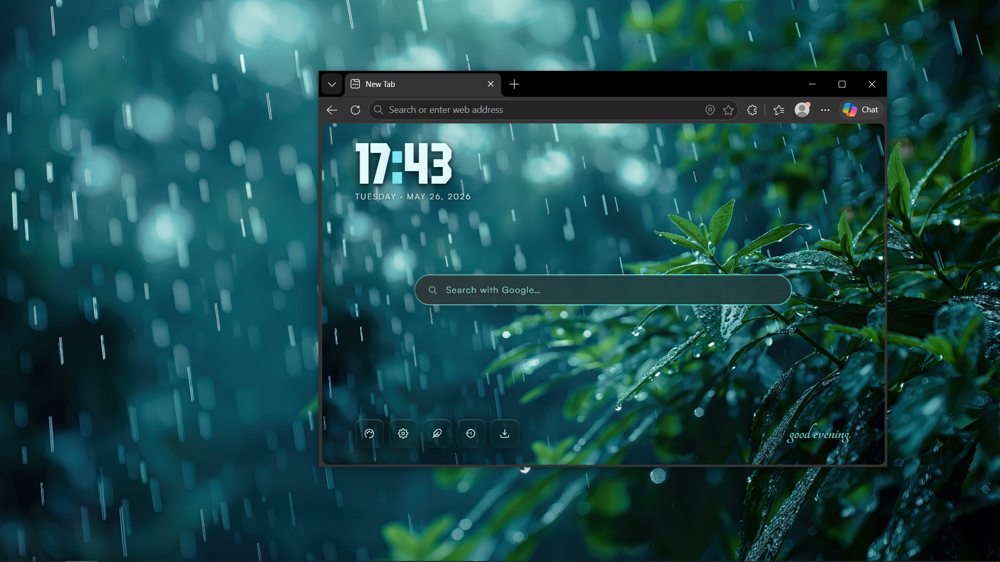
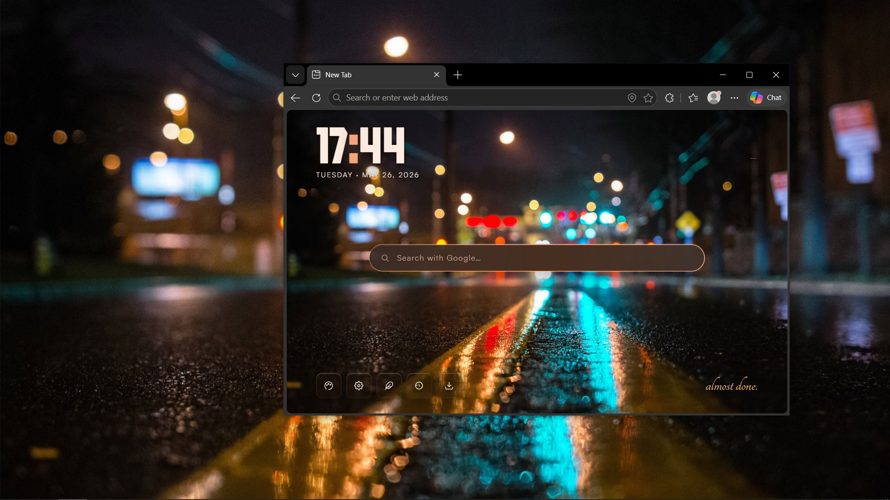
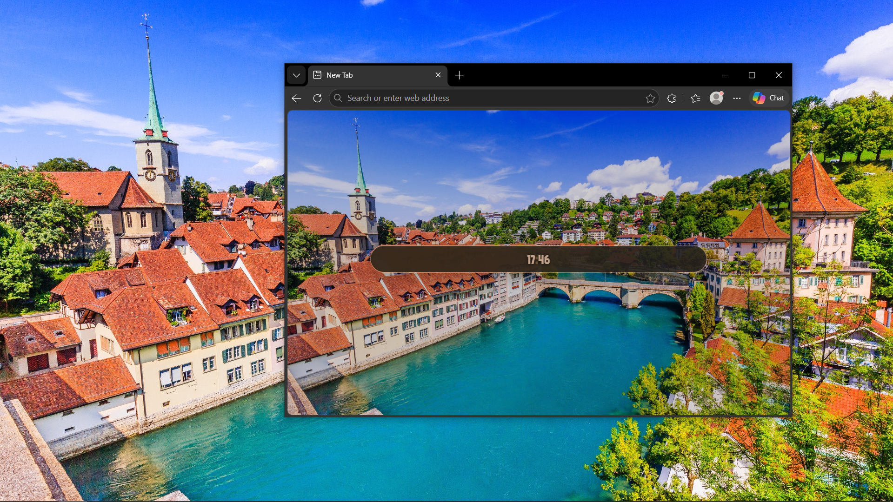
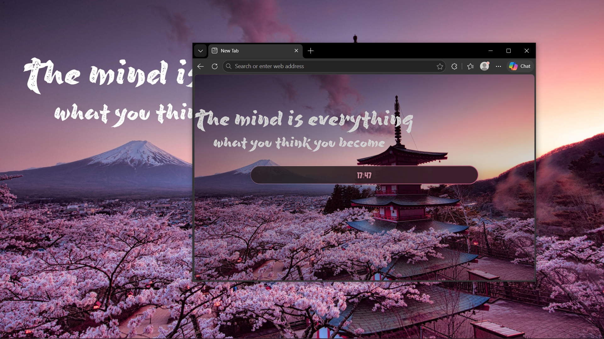
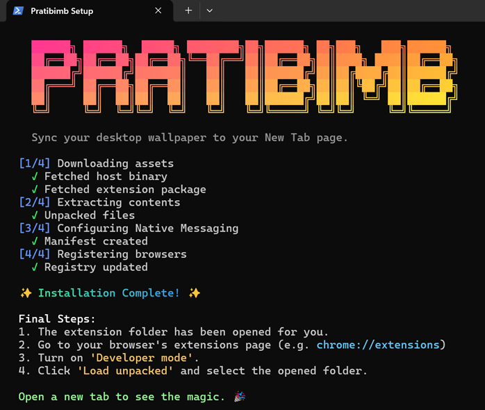
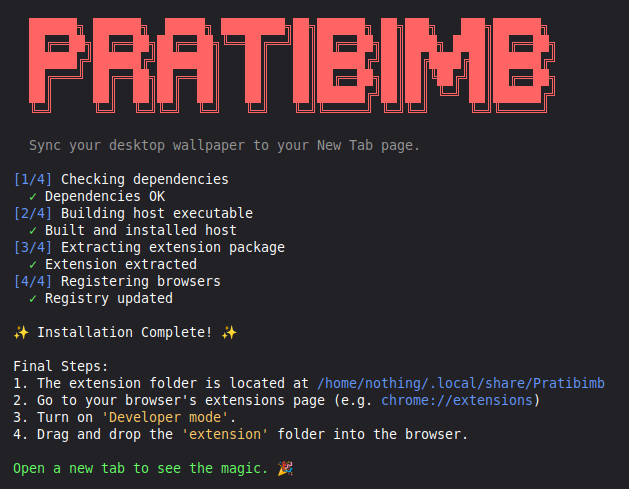

# Pratibimb

> *Your browser finally has the same energy as your desktop.*

***Pratibimb*** (Hindi for *reflection*) is a Chromium extension that syncs your Windows or Linux desktop wallpaper to your New Tab page — live, automatically, every time. The whole UI adapts to whatever wallpaper you're rocking. Moody dark wallpaper? Moody vibes. Bright summer meadow? You get the idea.

---

<div align="center">
  
  
  <br>
  <sub>active</sub>
  <br><br>
  
  
  <br>
  <sub>idle</sub>
  <br><br>
  <sub>looks different every time. that's the whole point.</sub>
</div>

---

## How it works

A tiny C++ program reads your wallpaper straight from Windows and passes it to the extension instantly — no background tasks, no polling, no funny business. The New Tab page then builds itself around it: lighting, glassmorphism, weather, search bar, all of it.

You also get a one-click installer that handles all the annoying registry and AppData stuff so you don't have to.

---

## Before you install — read this (it's short, I promise)

Windows 11 is *very* dramatic about local `.exe` files talking to browsers. Here's what might trip you up:

- **Defender might quietly block it** with zero explanation. If it's not working, add `%LOCALAPPDATA%\Pratibimb` as a Defender exclusion.
- **Store-installed browsers can't do this at all.** If you got your browser from the Microsoft Store, grab the direct installer from the browser's website instead.

**What actually works:**

| Operating System | Compatibility |
| :--- | :--- |
| **Windows 11** | ✅ Perfect on Chrome, Brave, and Edge |
| **Windows 10 / Tiny10** | ✅ Perfect on Chrome, Brave, and Edge |
| **Linux (Cinnamon)** | ✅ Perfect via CLI setup |

---

## Installation

### Windows



**Step 1** — Open PowerShell and run this command to install Pratibimb:
```powershell
irm https://raw.githubusercontent.com/SunTzv/Pratibimb/main/install/install.ps1 | iex
```

**Step 2** — The script will download and extract the extension, then open the folder. Go to `chrome://extensions` (or `edge://extensions`), turn on **Developer mode**, and click **Load unpacked**. Select the opened `extension` folder.

Open a new tab. That's it. 🎉

### Linux



**Step 1** — Open your terminal and run this command to install Pratibimb:
```bash
curl -sL https://raw.githubusercontent.com/SunTzv/Pratibimb/main/install/install.sh | bash
```

**Step 2** — The script will compile the native host, extract the extension, and automatically register it. Go to your browser's extensions page (e.g. `chrome://extensions`), turn on **Developer mode**, and drag and drop the `extension` folder that opened for you into the browser.

Open a new tab. That's it. 🎉

---

## Uninstalling

**Windows:** Open PowerShell and run this command to remove the host and registry keys:
```powershell
irm https://raw.githubusercontent.com/SunTzv/Pratibimb/main/install/uninstall.ps1 | iex
```
Then remove the extension from your browser. Gone without a trace.

**Linux:** Open your terminal and run this command:
```bash
curl -sL https://raw.githubusercontent.com/SunTzv/Pratibimb/main/install/uninstall.sh | bash
```
Wipes the generated JSON configs from your browsers and purges the binary from `~/.local/share/Pratibimb`. Remove the extension from your browser. Gone without a trace.

---

## Go deeper

[`DEV-LOG.md`](DEV_LOG.md) — the build journal, mistakes and all
(nothing for you mostly for me to track versions)

---

<sub>Favicon by Dupe (dupe_dupe on Discord) · Weather icons by <a href="https://basmilius.github.io/meteocons/fill.html">Bas Milius</a> · Fonts via <a href="https://github.com/TeaTimBuYT">TeaTimBuYT</a></sub>